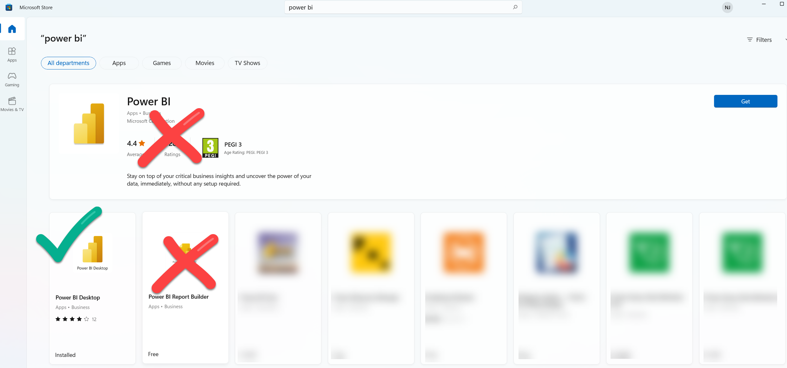
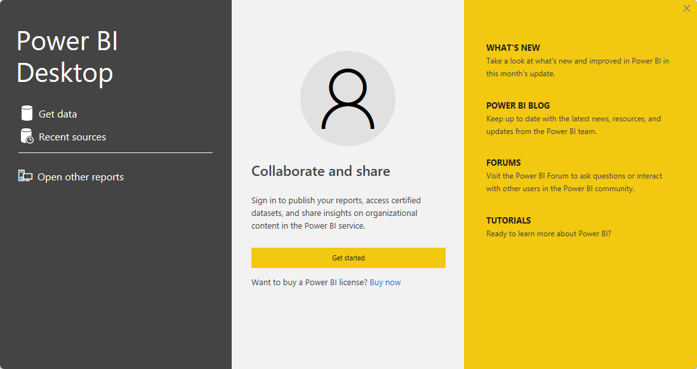
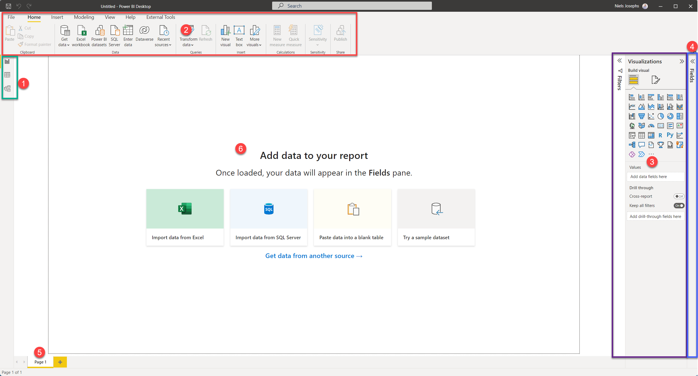
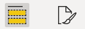

# 01 Introductie Power BI

## Power BI Desktop downloaden en de eerste start

### Downloaden van Power BI

Power BI Desktop is gratis te downloaden en op elke Windows-machine installeren. Mocht dat op jouw computer nog niet gedaan zijn, dan kun je Power BI downloaden [vanaf de Microsoft Store](https://aka.ms/pbidesktopstore), of vanaf [www.powerbi.com](https://www.microsoft.com/nl-nl/download/details.aspx?id=58494). Wanneer het mogelijk is, installeer Power BI Desktop dan vanuit de Microsoft Store: dit zorgt ervoor dat je automatisch updates e.d. krijgt, en deze niet handmatig hoeft te downloaden.

Wanneer je Power BI wilt installeren vanuit de Windows Store, let dan goed op! Zoals je ziet zijn er namelijk drie edities:

* **Power BI** is een tooltje voor tablets waarmee je rapporten enkel kunt weergeven
* **Power BI Desktop** is de tool waarmee je rapporten kunt bewerken en vormgeven
* **Power BI Report Builder** is de tool waarmee je gepagineerde rapporten kunt maken

Kies in de Microsoft Store voor **Power BI Desktop**.

### De eerste start

De eerste keer dat je Power BI start zie je het volgende scherm:

Klik op "Get Started" om in te loggen en met Power BI te starten.

Waarschijnlijk heb je nog niet automatisch een Power BI account. Je kunt met de knop **Sign up for Power BI** dit eenvoudig regelen. Als je dit proces in de browser volledig doorlopen hebt, kun je direct met je eigen Power BI account inloggen bij Power BI Desktop.

Het scherm ziet er nu als volgt uit:

Merk de volgende zaken op:

1. Linksboven zie je drie knoppen, waarmee je tussen *drie weergaven* van je Power BI model kunt schakelen:
   * **Rapport**
   * **Tabel**
   * **Model**
2. Bovenin zie je een **lint**, die net werkt als in Office kent. Het lint heeft acht onderdelen:
   * **Bestand**: Vergelijkbaar met het gelijknamige menu uit Office: opslaan, exporteren, printen en instellingen
   * **Start**: Hier staan de meeste "basis" zaken die je nodig hebt voor het maken van Power BI-rapportages
   * **Invoegen**: Diverse zaken die je toe kunt voegen aan je rapportage
   * **Model maken**: Hier staan specifieke zaken voor het inrichten van je datamodel
   * **Weergeven**: Hier kun je visuele hulpmiddelen aan- en uitzetten, en schakelen tussen de mobiele weergave en de desktop-weergave
   * **Optimaliseren**: Hier kun je hulpmiddelen vinden om de performance van jouw raport te beoordelen
   * **Help**: Dit is een bijzonder ingewikkeld concept, dat voor nu te ver reikt om uit te leggen ;-)
   * **Externe hulpprogramma's** wordt niet altijd weergegeven (hier op de screenshot wel), maar dit geeft de mogelijkheid om met andere software verder te bouwen aan Power BI-rapporten of -datamodellen
3. Aan de rechterzijde (paars omlijnd hierboven) zie je twee _panelen_: **Visualisaties** en **Filters**. Deze kun je in- en uitklappen door op de titel te klikken (Probeer het!). Er zijn drie grote onderdelen benoemd:
   * **Filters**: filters die van toepassing zijn op het huidige rapport, de huidige pagina, of de huidige visual
   * **Visualisaties**: De verschillende visualisaties die je in een rapport kunt gebruiken.
   * **Gegevens** / **Format**: Hier zie je geen tekst van, maar dit zijn twee icoontjes waarmee je veel eigenschappen van visuals kunt instellen:  
   
   * **Onderzoekenh**: Bijzondere drillthrough-filters (meer hierover later)
4. Uiterst rechts op het scherm (blauw omrand) is het **Gegevens** paneel. Ook deze kun je in- en uitklappen. Hier zie je een lijst van alle tabellen, kolommen en metingen die in je datamodel aanwezig zijn
5. Binnen de Rapportweergave, zie je onderin de verschillende **pagina's** van een rapport
6. Binnen de Rapportweergave is een groot wit vel aanwezig - het **canvas**. Hierop kun je je rapport vormgeven. De zwarte stippellijnen geven de randen aan.

## Volgende modules

De volgende module is [Module 2: Rapporteren op de dataset: Power BI als rapportageschil](../02-reporteren-op-dataset/02-reporteren-op-dataset.md). Hieronder vind je een overzicht van alle modules:

1. [Introductie Power BI Desktop](../01-introductie/01-introductie-powerbi-desktop.md) (huidige module)
2. [Rapporteren op Power BI Datasets en eerste visualisatie](../02-reporteren-op-dataset/02-reporteren-op-dataset.md)
3. [Visuals en interactie](../03-visualisaties-en-interactie/03-visualisaties-and-interactie.md)
4. [Onderzoeken](../04-onderzoeken/04-onderzoeken.md)
