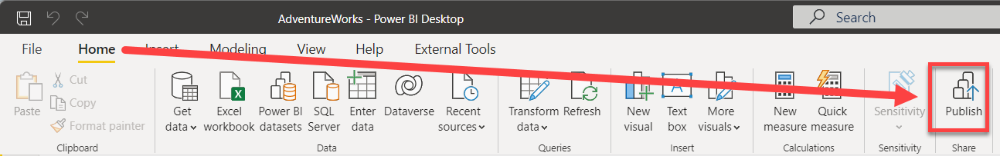
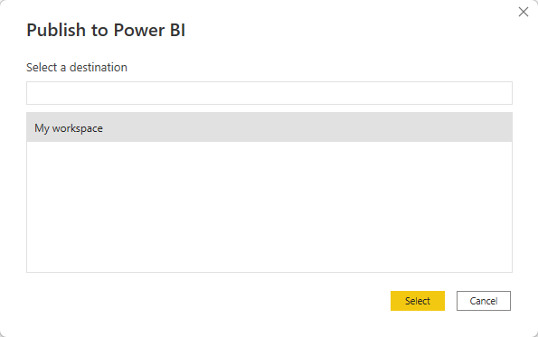
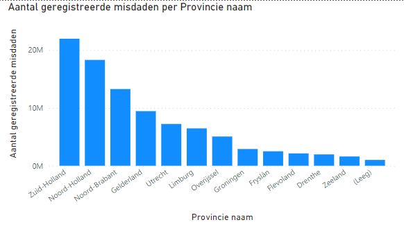
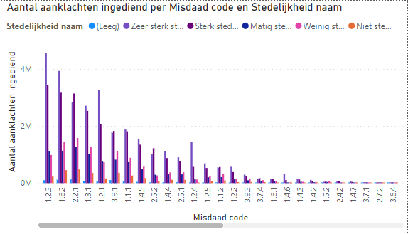
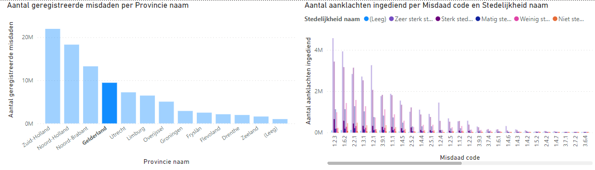
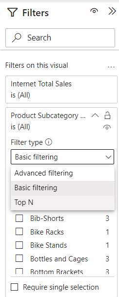
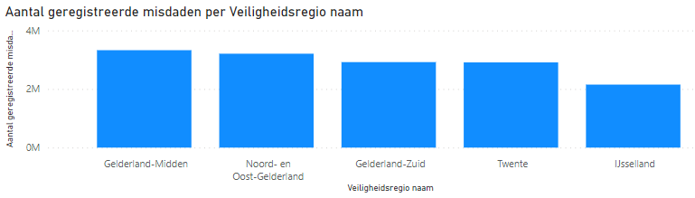
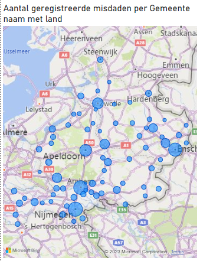
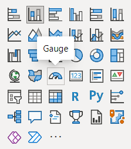
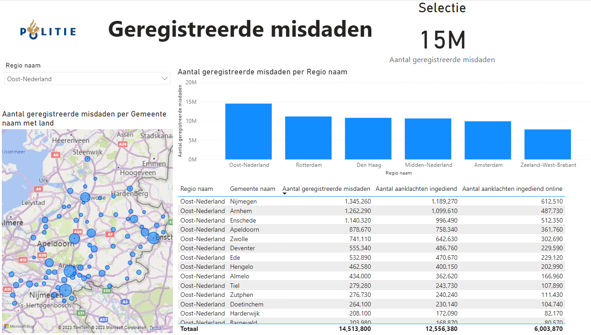

# 02 Rapporteren op de dataset: Power BI als rapportageschil
 
Power BI kan als volledige "self-service" tool gebruikt worden, maar ook inprikken op bestaande "datasets".

> ## Wat is een dataset
>
> Een dataset is een datamodel (verzameling aan tabellen en onderlinge verwijzingen) dat klaar staat voor analyse. Allerlei logica kan vooraf ingebouwd worden, zodat je door een paar klikken nieuwe vragen kunt stellen. Een paar termen die hier veel bij voorkomen:
>
> * **Metingen** (ook wel meetwaarden of measures) zijn de cijfers die je wilt analyseren.
>   * Vaak zijn dit eenvoudige, logisch optelbare waarden (zoals "aantal geregistreerde misdaden")
>   * Een dataset maakt het echter ook mogelijk om meer geavanceerde measures vorm te geven, bijvoorbeeld:
>     * Percentage van budget
>     * Aantal politiehelmen in magazijn
>     * Aantal geregistreerde misdaden in het jaar, opgeteld tot aan de weergegeven datum
>   * Door een dataset goed te definiëren, kun je ervoor zorgen dat ook ingewikkelde measures correct te berekenen langs allerlei *dimensies*.
> * **Dimensies** zijn de "assen" waarlangs je de metingen uitsplitst
>   * In de vraagstelling hoor je vaak *per*:
>     * Aantal misdaden *per jaar*
>     * Aantal geweldsdelicten *per stadsdeel* *per maand*
>     * Hoeveelheid huisvuil *per straat*
>   * Deze *per* definities zijn meestal dimensies:
>     * Stadsdeel
>     * Periode (maand/jaar/datum)
>     * Productcategorie
>     * etc.
>
> Datasets maken het ook mogelijk om het ontsluiten en modelleren van data door andere personen te laten doen dan het maken van de rapporten zelf. Maar ook wanneer je alles helemaal zelf doet, maak je altijd onder water een dataset aan.

## Voorbereiding

Voordat we met deze dataset van start kunnen, moet je de dataset op jouw eigen Power BI-omgeving klaarzetten. Neem daarvoor de volgende stappen:

1. Open het bestand [dataset.pbix](https://learningresourcestorage.blob.core.windows.net/jorik/PowerBI_politie/dataset.pbix)
1. Klik op de knop **Publiceren**  
     
   Het venster **Publiceren naar Power BI** opent zich nu, en vraagt je om een *Werkruimte* te selecteren om je publicatie in te doen.
1. Kies hier voor **Mijn Werkruimte**, en klik op **Selecteren**:  
     
   Als het goed is verschijnt er een groen vinkje en de tekst **Voltooid**
1. Sluit het venster door op de knop **OK** te klikken
1. Sluit het Power BI venster

    **Let op: het is belangrijk dat je geen Power BI-vensters meer open hebt staan na deze stappen!**

    ## Verbinding maken met de Power BI Dataset

    Je hebt zojuist een Power BI dataset voor jezelf klaargezet. Dit was een stukje voorbereiding dat we nu zelf moesten doen, maar normaal gesproken kan dit ook door iemand anders gebeuren. Bijvoorbeeld door iemand uit een Business 
    Intelligence- of Data Engineering-team, die data heeft klaargezet die breed gebruikt wordt op diverse plekken in de organisatie.

1. Open **Power BI Desktop**
1. Maak verbinding met een **Power BI Dataset**:
    * Klik op het pijltje onder "Get Data"
    * Kies **Power BI Datasets**
    * Kies het model **dataset**
    * Klik op **Connect**

    > ## De casus
    >
    > In deze cursus kijken we naar  een voorbeelddataset met misdaden die in [Kaggle](https://www.kaggle.com/datasets/maxscheijen/dutch-crimes/data) beschikbaar is gesteld. Het betreft registraties per gemeente en type misdaad. Dit hebben we aangevuld met geografische context over provoncies en regio's uit een openData dataset van het CBS.

    ## Eerste visualisatie

    Doordat we ingeprikt hebben op een bestaande dataset, kunnen we gebruikmaken van kwalitatief hoogstaande data. Deze is al gecontroleerd op missende waarden, inconsistentie en andere zaken waar we vaak tegenaan lopen wanneer we zelf data inladen. Ook is in het datamodel aangegeven hoe de verschillende relaties tussen de tabellen liggen, en zijn er meestal *measures* aangemaakt waarin berekeningen "klaarstaan" die voor onszelf vaak lastiger zijn. We kunnen dus eenvoudig data uit meerdere tabellen combineren - de dataset zorgt voor de juiste interacties.

    In deze eerste verkenning gaan we de data bekijken. Specifiek kijken we naar het **Aantal geregistreerde misdaden** en het **Aantal klachten ingediend**. Om een gevoel te krijgen hoe de data eruit ziet, maken we hier enkele doorsnijdingen mee.

    We gaan nu twee Power BI visualisaties maken:

    * Aantal geregistreerde misdaden per Provincie naam
    * Aantal aanklachten ingediend Misdaden per Gebeurtenis code

    ### Aantal geregistreerde misdaden per Provincie naam

    Deze is redelijk eenvoudig:

1. Zoek in het **Gegevens** paneel via de zoekbox de *meting* **Aantal geregistreerde misdaden**. Klik deze aan.  
1. Zoek nu naar "Provincie", en vink **Provincie naam** aan.

    Zoals je ziet, gaat deze grafiek eigenlijk automatisch goed. En hoewel de hoeveelheid tabellen en kolommen erg groot kan zijn, kun je eenvoudig zoeken in de lijst met velden.

      

    ### Aantal aanklachten ingediend Misdaden per Gebeurtenis code

1. Probeer nu stappen 8 en 9 opnieuw uit te voeren, maar maak deze keer de grafiek te maken voor **Aantal aanklachten ingediend** en **Gebeurtenis code**

    Omdat "Gebeurtenis code" een numerieke waarde is, maakt Power BI hier automatisch een zogenaamde *meting* van: een meetwaarde die optelbaar is. Je ziet dus de som van alle codes nu weergegeven naast de ingediende aanklachten. Wanneer je het sigma-teken &Sigma; ziet staan voor een veld, is dit een indicatie dat Power BI het als *meting* kan gebruiken (hoewel de dataset het niet expliciet als *meting* heeft aangeboden!)

1. Zorg er nu voor dat de grafiek die je zojuist gemaakt hebt geselecteerd is.
1. Verplaats nu in de **Eigenschappen** van de grafiek (onder het **Visualisaties** paneel) het veld **Gebeurtenis code** van het kopje **Y-as** naar **X-as**.

    Hiermee geven we aan dat "Gebeurtenis code" niet een veld is dat we willen optellen, maar dat we op de as willen zetten, om erlangs uit te splitsen.
    We kunnen dit ook expliciet aangeven door het direct vanuit het **Gegevens** paneel  naar de goede eigenschap van de visualisatie te slepen, in plaat van het aan te klikken.

1. Vervang nu de **Gebeurtenis code** in de visualisatie door **Misdaad code**.
   
    Stel dat we nu een extra uitsplitsing zouden willen doen naar de regio. Zorg er nu voor dat de grafiek die je zojuist gemaakt hebt geselecteerd is.
  
1. Sleep het veld **Stedelijkheid naam** uit tabel **Geografie** vanuit het **Gegevens** paneel naar het kopje **Legenda**
1. *Resize* de grafiek zodat deze netjes wordt weergegeven:

         

    ## Interactie tussen grafieken

    Klik op één van de provincie's in de eerste grafiek. Zoals je ziet verandert de andere grafiek mee.

         

    ## Hands-on: rapportage maken

    Aangezien Power BI nieuw is binnen de politie, is je leidinggevende bijzonder benieuwd wat er allemaal mee mogelijk is. Hij heeft onder andere veel gehoord over de geografische weergaves die er standaard in aanwezig zijn, en heeft jou gevraagd eens één en ander mee uit te proberen.

    Hieronder staan op een iets hoger niveau de stappen om een rapport te maken. Dit is bewust (zodat je ervaring met de tool vergroot wordt) - maar tegelijkertijd is het heel normaal dat je ergens niet uitkomt. Dan helpt het niet om lang te zitten tobben - vraag gerust om hulp!

1. Maak een nieuwe pagina, genaamd 'Geregistreerde misdaden'
1. Schakel naar deze nieuwe pagina
1. Maak een grafiek waarin je het **Aantal geregistreerde misdaden** uitzet tegen de **Veiligheidsregio naam** (*neem deze uit de dimensie Geografie*!)
1. Selecteer deze grafiek.
1. Verander de **Filters op deze visual** voor **Veiligheidsregio naam** in een **Populairste N** filter

    

1. Filter deze op de top 6, sleep het veld "**Aantal geregistreerde misdaden** naar het kopje **Op waarde**.
1. Klik **Filter toepassen**

     

1. Probeer nu zelf een **Kaart visual** toe te voegen (dit is het "witte" wereldbolletje onder **Visualisaties**). Zet hierin de **Gemeente naam met land** uit tegen **Aantal geregistreerde misdaden**. Maak de grafiek vervolgens breed genoeg zodat alle gemeentes waar geregistreerd zijn duidelijk zichtbaar zijn.

     

1. Voeg nu een **Tabel visual** toe met daarin de volgende velden:
    * **Regio naam**
    * **Veiligheidsregio naam**
    * **Gemeente naam**
    * **Aantal geregistreerde misdaden**
    * **Aantal aanklachten ingediend**
1. Plaats de grafiek en tabel direct onder elkaar, en maak ze exact even breed.
1. Voeg nu een titel toe aan de pagina, door een **Tekstvak** te kiezen uit het **Start** lint. Maak deze tekst groter (bijv. 32), en vul de tekst **Geregistreerde misdaden** in. Plaats deze volledig linksbovenin het rapport
1. Voeg een **Kaart visual** toe (icoontje met 123) voor het veld **Aantal geregistreerde misdaden** en voeg in de opmaak de titel **Selectie** toe

    > Om te ontdekken wat een **Kaart** visual is, zul je de namen van de tooltips moeten verkennen. De naam van een visual wordt weergegeven als *tooltip* wanneer je de cursor er enige tijd op laat rusten:
    >
    > 

1. Voeg nu een **Slicer visual** toe en baseer het op **Regio naam**. Pas in de opmaak van de visual de weergave aan tot **Vervolgkeuzelijst**. 
1. Maak de pagina af met een willekeurig bedrijfslogo linksbovenin (je kunt hier bijvoorbeeld het Politie-logo opzoeken, of je eigen plaatje naar keuze)

    Het eindresultaat kan er bijvoorbeeld als volgt uit zien:

    

## Volgende modules

De volgende module is [Module 3: Visuals en interactie](../03-visuals-and-interaction/03-visuals-and-interaction.md).

Hieronder vind je een overzicht van alle modules:

1. [Introductie Power BI Desktop](../01-introduction/01-introduction-powerbi-desktop.md)
2. [Rapporteren op Power BI Datasets en eerste visualisatie](../02-reporting-on-dataset/02-reporting-on-dataset.md) (huidige module)
3. [Visuals en interactie](../03-visuals-and-interaction/03-visuals-and-interaction.md)
4. [Drillthrough](../04-drillthrough/04-drillthrough.md)
5. Self-service reporting
   * [CSV-bestanden inladen](../05-self-service-reporting/05-csv-inladen.md)
   * [SQL data inladen](../05-self-service-reporting/06-sql-inladen.md)
6. Data Modeling 101
   * [Relaties](../06-data-modeling-101/07-relaties.md)
   * [Opschonen van je datamodel](../06-data-modeling-101/08-opschonen.md)
7. [Introductie Power Query (GUI)](../07-power-query-gui/09-power-query.md)
8. [Publiceren en samenwerken in workspaces](../08-publishing-and-collaboration-in-workspaces/10-publishing-and-collaboration-in-workspaces.md)
9. [Calculated Columns met DAX](../09-dax/11-calc-columns.md)
