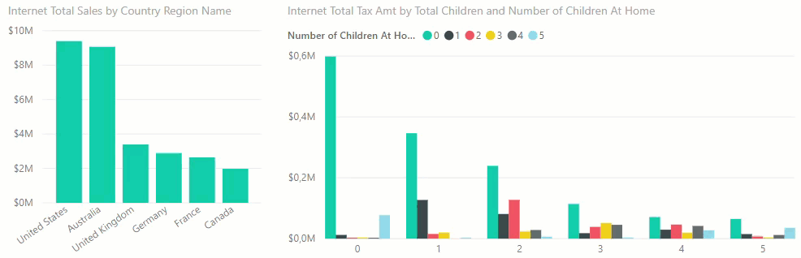
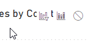
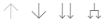
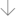
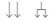

# 03 Visuals en interactie

Binnen Power BI zitten veel mogelijkheden om de weergave en werking van je rapporten aan te passen. In deze module willen we hier iets verder naar kijken aan de hand van de volgende punten:

* Interacties tussen grafieken
* *Drilldown* en hiërarchie
* Voorgedefinieerde hiërarchie gebruiken
* Aanpassen van visuals
* *Custom visuals* van de *Power BI Marketplace*

## Interacties

Zoals je in [de vorige module](../02-rapporteren-op-dataset/02-rapporteren-op-dataset.md) gezien hebt, is er binnen Power BI automatisch *interactie* tussen de grafieken. Wanneer je op één grafiek klikt, heeft dit effect op een andere grafiek:

* Selecteer nu de rechtergrafiek op **Pagina 1** (*Aantal klachten ingediend per Misdaad code en Regio naam*).

Op het moment dat je een grafiek selecteert, verschijnen er bovenin het scherm twee nieuwe items op het lint: *Indeling* en *Gegevens/analyseren*

* Selecteer de tab **Indeling**, en klik op de knop **Interacties bewerken**

Je ziet nu in je rapport rechtsboven elk object waar data in zit *behalve de huidig geselecteerde grafiek* één of meer van de volgende icoontjes verschijnen:

Dit bepaalt hoe de bewuste grafiek zal reageren wanneer je de door jou geselecteerde grafiek van selectie verandert:

* **Filteren** (optie 1) - alle data die niet binnen de selectie valt, wordt niet weergegeven
* **Markeren** (optie 2, standaardinstelling) - alles buiten de selectie wordt lichter gekleurd weergegeven
* **Geen** (optie 3) - er verandert niets, ongeacht wat je aanklikt

Probeer de drie opties uit, en zie de effecten (alleen zichtbaar als je een selectie hebt gemaakt).

Verander nu het rapport op de pagina **Geregistreerde misdaden** zodanig dat:

* Een nieuwe kaart (icoontje 123) wordt toegevoegd naast de bestaande **Selectie** o.b.v. meting **Aantal geregistreerde misdaden** met titel "Landelijk".
* Interactie vanuit de andere visuals naar deze kaart ingesteld staan op **Geen**. Deze cijfers veranderen dus niets, ongeacht je selectie.
* Wanneer je rechtsonder in de tabel iets selecteert (bijv. "Nijmegen"), wordt de landkaart niet gefilterd (geen interactie). Een selectie vanuit de slicer heeft wel effect op de landkaart. Hier zijn dus dan alleen de misdaden van die betreffende regio('s) zichtbaar.

Controleer de resultaten door "Oost-Nederland" te selecteren in de grafiek. Het landelijke cijfer moet niet veranderen. De landkaart laat alleen de gemeenten in Oost-Nederland zien.
Selecteer in de tabel de gemeente "Apeldoorn". De landkaart laat nog steeds heel Oost-Nederland zien. De cijfers van Apeldoorn zijn gemarkeerd in de grafiek. 

## Hiërarchie en drilldown

### Hiërarchie

Veel van de data die we analyseren heeft een hiërarchie in zich:

* Eerste analyses gebeuren op jaar- of kwartaalcijfers, daarna dalen we af richting maanden of dagen
* We starten met een analyse van de performance van accountmanagers, kijken daarna specifieker naar de onderliggende klanten
* We analyseren onze productverkopen per categorie, zien dat de meeste verkopen in fietsen zitten, dus splitsen we die uit in de subcategorieën.

In de datamodellen die we vanuit een dataset of Power BI-model afnemen, wordt data vaak al in een hiërarchie aangeboden. Bijvoorbeeld de Geografie-hiërarchie in de tabel *Geografie*:

* Maak een nieuwe pagina
* Selecteer de *meting* **Aantal geregistreerde misdaden**
* Selecteer de *hiërarchie* **Geografie** in de tabel **Geografie**
* Klik nu in de visualisatie twee keer op het pijltje naar boven (rechterbovenhoek)
* Bekijk de grafiek-eigenschappen. 
  * Onder "X-as" staat *Geografie*
  * Je ziet hier diverse niveaus (Regio naam, Veiligheidsregio naam, gemeente naam), toch is in de grafiek momenteel enkel het hoogste niveau zichtbaar.
* Maak de grafiek wat breder, zodat je de volledige titel kunt zien. De titel is momenteel "Aantal geregistreerde misdaden per Regio naam": het zichtbare niveau dus.

### Drilldown: eerste verkenning

Rechtsboven in de grafiek bevindt zich de verzameling met pijltjes. Deze zijn bedoeld om door de hiërarchie heen te navigeren.

* Klik op het pijltje naar beneden ().
  * Dit pijltje staat voor *drilldown* (de BI-term voor het "inzoomen" naar een lager niveau)
* Klik nu op de categorie "Oost-Nederland". Je ziet dat:
  1. De titel van de grafiek verandert naar *Aantal geregistreerde misdaden per Regio naam en Veiligheidsregio naam*
  2. De Veiligheidsregio's op het Veiligheidsregio naam-niveau worden weergegeven *die zich binnen Oost-Nederland bevinden*
* Wanneer je weer wilt uitzoomen (*drill up*), klik je op het pijltje naar boven.

### Meer hiërarchie en drilldown

Een andere hiërarchie die in deze dataset aanwezig is, is de *Kalender* hiërarchie (binnen de tabel **Kalender**). 

* Maak een grafiek waarin de **Aantal geregistreerde misdaden** wordt uitgesplitst over **Kalender**.
* *Drilldown* naar het jaar 2020.
  * De grafiek **Aantal geregistreerde misdaden per Regio naam** filtert nu mee.

Wanneer we nu een *drill down* doen op een jaar, komen we eerst bij een semester, en daarna bij een kwartaal. Dat is wel een beetje veel van het goede. Daarom gaan we deze velden (voor deze specifieke grafiek) uit de hiërarchie halen.

* In de eigenschappen van de grafiek, onder *X-as*, verwijder de niveaus **Semester** en **Dagnummer**

De hiërarchie is nu *in deze grafiek* Jaar-Kwartaal-Maand geworden. Verifieer dit.

### Handmatige hiërarchie

* Selecteer nu opnieuw de linkergrafiek *Aantal geregistreerde misdaden per Regio naam*
* Sleep vanuit het **Gegevens** *paneel* het veld **Misdaad omschrijving** uit de tabel **Registraties (gemeente)** naar het **X-as** veld. Plaats het veld *onder* de *Geografie* hiërarchie.

We kunnen nu via een *drilldown* verder afdalen door de *Geogradie* hiërarchie, naar de verschillende misdaadtypen die in een gemeente zijn geregistreerd.

### Naar het volgende niveau

Naast een *drilldown* kun je ook een niveau afdalen in de hiërarchie zonder dat je je specifiek beperkt tot één categorie. Dit kan met de rechter twee knoppen:

Ga in de linkergrafiek naar het hoogste niveau (dus *Regio naam*), en probeer de laatste twee knoppen uit. Wat is het verschil?

### Filteren van andere visuals

Zoals je wellicht opgevallen is, zorgt een *drilldown* er ook voor dat andere grafieken gefilterd worden: wanneer je in de linkergrafiek een regio selecteert, verandert de grafiek *Aantal geregistreerde misdaden per Jaar* ook mee.

Standaard werkt de filtering van een *drilldown* gelijk aan de filtering van een *selectie* (die je bijvoorbeeld via **Interacties bewerken** ingesteld hebt) binnen de grafiek. Je kunt de drilldown-filtering echter ook uitschakelen.

* Selecteer de linkergrafiek (*Aantal geregistreerde misdaden per Regio naam*)
* Open het menu *Indeling*
* Naast de knop *Interacties bewerken* staat een dropdown menu, wijzig daar *Volledige pagina* in *Geselecteerde visual*.

Nu zorgt een *drilldown* niet meer automatisch voor een filtering binnen een andere grafiek. Selecties werken nog wel.

## Volgende modules

De volgende module is [Module 4: Onderzoeken](../04-onderzoeken/04-onderzoeken.md).
