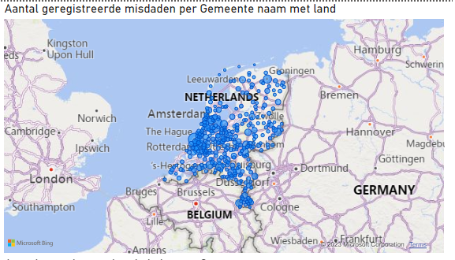
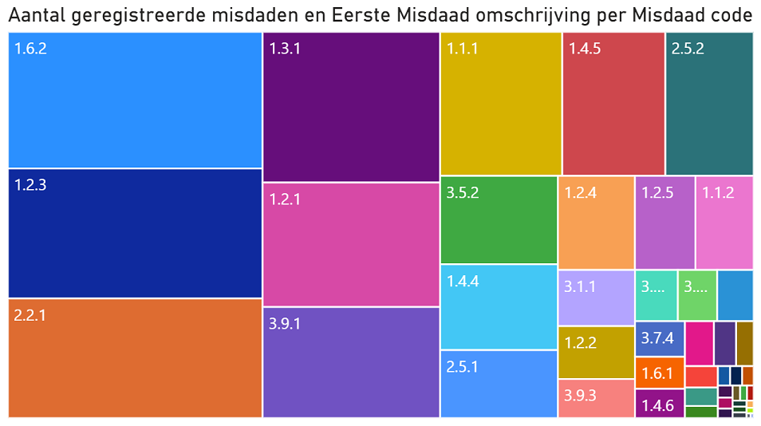
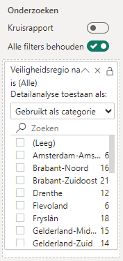
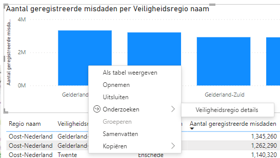
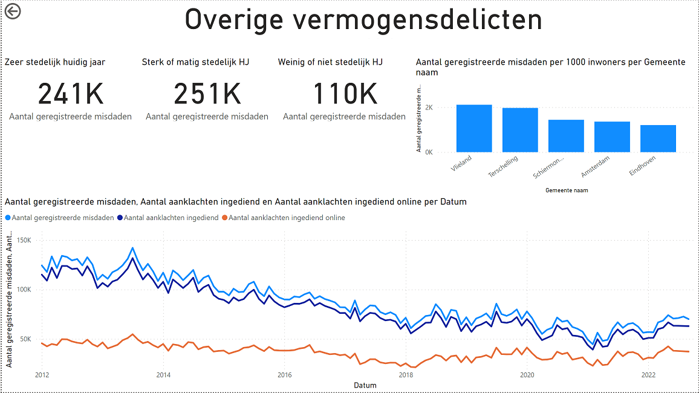

# 04 Onderzoeken

## Voorbereiding

Ga verder met het bestand dat je in de vorige module hebt gemaakt.

## Opdracht

Binnen de **Politie** is je leidinggevende bijzonder te spreken over de geografische mogelijkheden van Power BI. Het is echter niet heel handig om alle geografische achtergrondinformatie over een regio in elk rapport te herhalen. Het liefst zou ze bij bijvoorbeeld een uitschieter in registraties in een bepaalde veiligheidsregio willen kunnen "doorklikken" naar alle informatie van die veiligheidsregio. Bijvoorbeeld de trend in misdaden de afgelopen jaren, de verdeling naar type misdaad in de gemeenten, etc..

Dit "doorklikken" wordt in Power BI **Onderzoeken** genoemd. In [module 3](../03-visuals-en-interactie/03-visuals-en-interactie.md) hebben we al gekeken naar de *drilldown*. *Onderzoeken* houdt in de basis in dat je een getal onder de loep neemt op een andere pagina of in een ander rapport. Op deze manier kun je eenvoudig de context bekijken - bijvoorbeeld van de misdaden binnen een bepaalde veiligheidsregio.

## Onderzoeken binnen een rapport

Wanneer je *onderzoeken* binnen een rapport mogelijk wilt maken, moet je de volgende zaken regelen:

*. Er moet een pagina zijn wat het *doel* van je onderzoek is.
   * In het voorbeeld hierboven: de pagina "Veiligheidsregio details"
*. Op deze *doel*pagina moet je een "analyseveld" instellen. In het voorbeeld hierboven is dit de naam van de veiligheidsregio: wanneer je die ergens in het rapport tegenkomt, kun je in twee klikken naar de detail-pagina navigeren, wat dan automatisch gefilterd is op de betreffende categorie.
   * In het voorbeeld hierboven is het *analyseveld* `Veiligheidsregio naam`.

### Drillthrough instellen in je rapport

1. Voeg een pagina toe met de naam "Veiligheidsregio details"
1. Voeg hierop een *Kaart visual* toe (). Configureer deze als volgt:
    * **Locatie**: **Gemeente naam met land** (tabel *Geografie*)
    * **Belgrootte**: **Aantal geregistreerde misdaden** (tabel *Registraties (gemeente)*)
    
    

1. Voeg nu ook een zgn. "Treemap" visual toe voor *Aantal geregistreerde misdaden per Misdaad omschrijving*:

    
    Deze visual ziet er nu nog overweldigend uit, maar zal gefilterd worden.
   
1. Klik ergens op het canvas zodat er geen *visual* meer geselecteerd is.
1. In het **Visualisaties** paneel onder het kopje **Onderzoeken** vind je nu een vakje "Analysevelden hier toevoegen". Sleep hier het veld **Veiligheidsregio naam** heen (tabel *Geografie*)

    
   
1. Ga terug naar de pagina *Geregistreerde misdaden*, en rechtsklik op één van de veiligheidsregio's in de grafiek. Als het goed is heb je nu een submenu *Onderzoeken* naar de *Veiligheidsregio details*-pagina

    

    Om het af te maken, kun je nu de **Veiligheidsregio details** pagina verbergen (rechtsklik op de tab, kies **Verbergen**). Publiceer het rapport naar een workspace en bekijk het resultaat.

    Probeer nu zelf een tweede onderzoeks-pagina "Misdaad details" aan te maken waarbij je alle gegevens over een misdaadtype op een rij zet. Filter op basis van het veld **Misdaad code** (tabel *Registraties (Gemeente)*). Geef de volgende zaken weer:

    *Bij elk punt staat wat extra uitdaging - deze hoef je niet uit te voeren. Mocht alles je echter gemakkelijk afgaan en je wilt wat meer de grenzen van Power BI opzoeken, dan kun je je hier even in vastbijten*

    1. Aantal geregistreerde misdaden per type stedelijkheid
      * Extra uitdaging: voeg bijbehorende titels toe binnen de visual ("Zeer sterk stedelijk", "Sterk / matig stedelijk", etc.)
    2. Aantal geregistreerde misdaden per 1000 inwoners per Gemeente naam
      * Extra uitdaging: geef alleen de 5 gemeenten weer die het hoogst scoren
    3. Aantal geregistreerde misdaden, Aantal ingediende aanklachten en Aantal ingediende aanklachten online per datum

    

    Wanneer je drillthrough pagina correct werkt, zou je vanaf pagina "Pagina 1" nu een drillthrough moeten kunnen maken naar "Misdaad details".

## Drillthrough tussen meerdere rapporten

*Drillthrough* is ook mogelijk tussen meerdere rapporten: je kunt dan de data vanuit een andere invalshoek meer verdieping geven in een ander rapport.

Om Drillthrough tussen meerdere rapporten werkend te krijgen hebben we (minstens) twee rapporten nodig:

* Het *bron-rapport*. Dit is het rapport waar je vandaan komt (hier "doe" je een drillthrough)
* Het *doel-rapport*. Dit is het rapport waar je terecht komt na een drillthrough.

Maak nu eerst via *File*, *New* een nieuw rapport dat verbinding maakt met de dataset in je eigen workspace en sla dit op onder de naam *module-4-drillthrough-rapport*.

Maak in dit nieuwe rapport een drillthrough filter per **Provincie naam** (tabel *Geografie*).

Je kunt vervolgens in het lijstje onder deze instelling een provincie kiezen die je *nu* wilt weergeven (feitelijk filter je de data op "alleen de data van provincie X"). Zodra je via een *drillthrough* op dit rapport belandt, wordt dit filter vervangen door de provincie waarmee je de drillthrough uitvoert. Het toevoegen van dit filter geeft je echter een beter gevoel over hoe de cijfers eruit zou zien bij een drillthrough van (bijvoorbeeld) Gelderland.

Vul vervolgens het rapport met inzichten over een provincie.

Stel vervolgens de drillthrough reporting in:

* In het **bron-rapport** (waar de drillthrough vandaan komt)
  * **Bestand** -> **Opties en instellingen** -> **Opties**
  * Onder **Huidig bestand**, open **Rapportinstellingen**
  * Zet het vinkje bij **Visuals in dit rapport toestaan om drillthroughdoelen van andere rapporten te gebruiken**
* In het **doel-rapport** (waar de drillthrough naartoe gaat):
  * Zet het vinkje **Kruisrapport** bij je **Analyseveld**
    
Publiceer het rapport, en test of de drillthrough over rapporten heen werkt in de Power BI Portal.

## Bonus-opgaven

### Aanpassen drillthrough-naam

Standaard heeft de drillthrough de naam `Pagina1 [naam-van-oorspong-rapport]`. Zorg ervoor dat hier een zinnige naam komt te staan, die de lading dekt.
